# Design Template - VectorTable - 

## Simple
### Simple black
Variable name is "vt_simple_black".

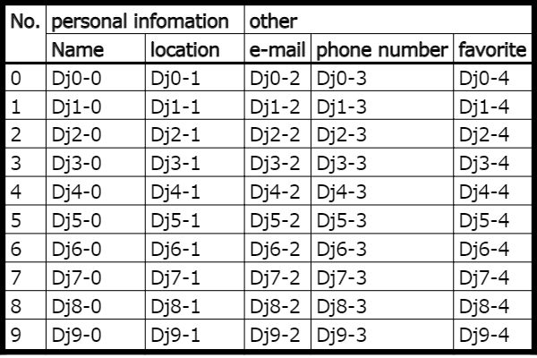

### Simple black header column 1
Variable name is "vt_simple_black_hc1".

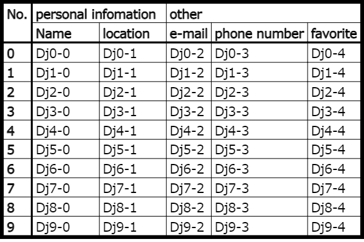

## Stripes
### Stripes black
Variable name is "vt_stripes_black".

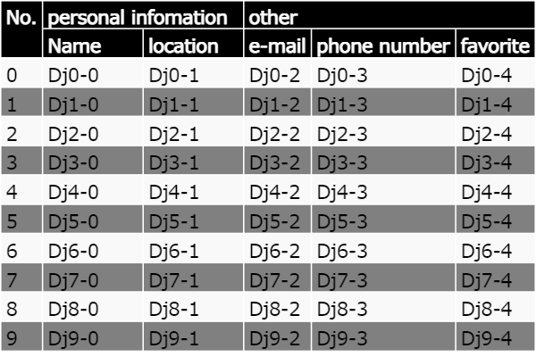

### Stripes blue
Variable name is "vt_stripes_blue"

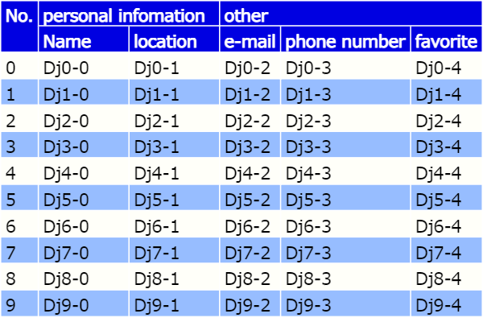

### Stripes green
Variable name is "vt_stripes_green"

### Stripes orange
Variable name is "vt_stripes_orange"

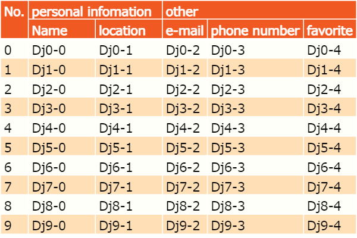

## Pale color
### Pale gray
Variable name is "vt_pale_gray"

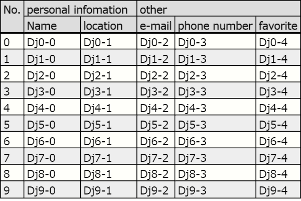

### Pale gray header column 1
Variable name is "vt_pale_gray_hc1"

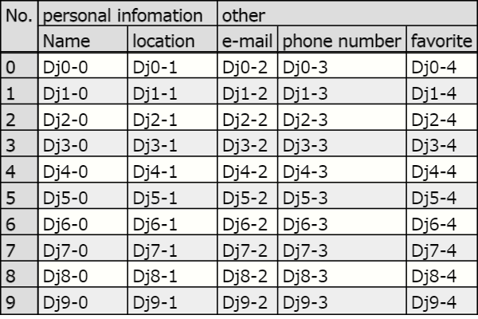

### Pale blue
Varible name is "vt_pale_blue"

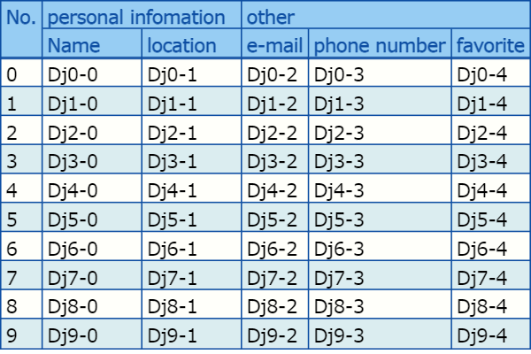

### Pale blue header column 1
Variable name is "vt_pale_blue_hc1"

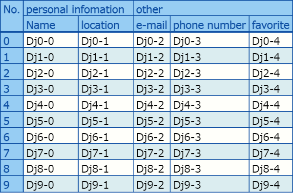

### Pale green
Variable name is "vt_pale_green"

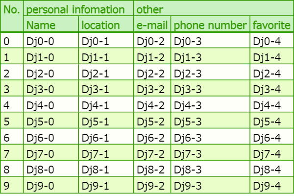

### Pale green header column 1

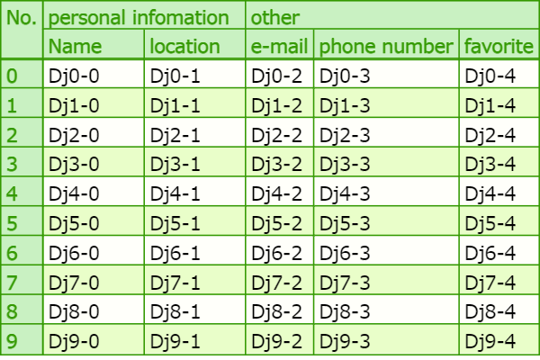

### Pale orange
Variable name is "vt_pale_orange"

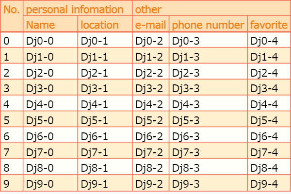

### Pale orange header column 1
Variable name is "vt_pale_orange_hc1"

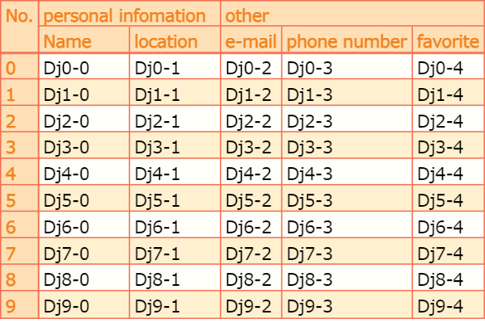