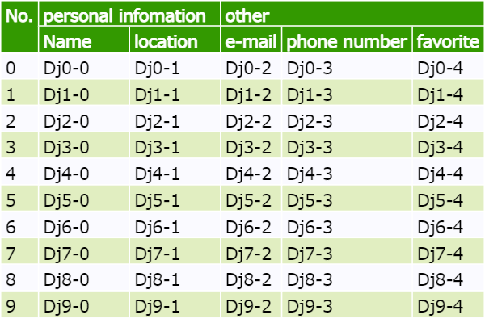

# VectorTable.ts
The html Table using SVG and TypeScript.

## How to use
* See "build/sample.html"

## Mouse menu
### Contextmenue
* Save as PNG:
  * Download PNG image of a target table.
### Mouse Wheel
* Zoom
### Mouse Drag
* Pan 

## Design Template
[Click this link](./DesignTemplate/DesignTemplate.md)

## Setting
### Required
#### id:
* element's id for Vector Table.

### Optional
#### Basic
* row_dir_line:
  * Whether to drow row direction lines.
  * Data type is "bool"
  * true: drow, false: not.
  * Default value is [ true ].
* col_dir_line:
  * Whether to drow column direction lines.
  * Data type is "bool"
  * true: drow, false: not.
  * Default value is [ true ].
#### Line shape
* stroke_width:
  * For set table's line width.
  * Data type is "float".
  * Default value is [ 1.0 ].
* stroke:
  * For set table's line color.
  * Data type is "svg color".
    * "black", "gray", "#aab", "#aabbcc", ...
  * Default value is [ "black" ].
  
#### Background color
* background_color:  
  * For set background color.
  * Data type is "svg color".
    * "black", "gray", "#aab", "#aabbcc", ...
  * Default value is [ "white" ].

#### Text shape
* text_font_size:
  * For set font size.
  * Data type is "float".
  * Default value is [ 10.0 ].
* text_font_stroke_width:
  * For set font weight.
  * Data type is "float".
  * Default value is [ 0.1 ].
* text_font_stroke:
  * For set font color.
  * Data type is "svg color".
    * "black", "gray", "#aab", "#aabbcc", ...
  * Default value is [ "black" ].
* text_margin_top:
  * For set margin top, upper side.
  * Data type is "float".
  * Default value is [ 0.0 ].
* text_margin_bottom:
  * For set margin bottom, lower side.
  * Data type is "float".
  * Default value is [ 0.0 ].
* text_margin_right:
  * For set margin right.
  * Data type is "float".
  * Default value is [ 0.0 ].
* text_margin_left:
  * For set margin left.
  * Data type is "float".
  * Default value is [ 0.0 ].

#### outer_frame
* outer_frame:
  * Whether to change an outer frame shape or not.
  * Data type is "bool".
  * true: change, false: not.
  * Default value is [ false ].
* outer_frame_stroke_width:
  * For set outer frame's line width.
  * Data Type is "float"
  * Default value is same with "stroke_width".
* outer_frame_stroke:
  * For set outer frame's color.
  * Data type is "svg color".
    * "black", "gray", "#aab", "#aabbcc", ...
  * Default value is same with "stroke".

#### Header
* header_row:
  * Whether to change a row direction header shape or not.
  * Data type is "bool".
  * true: change, false: not.
  * Default value is [ false ].
* header_col:
  * Whether to change a column direction header shape or not.
  * Data type is "bool".
  * true: change, false: not.
  * Default value is [ false ].
* header_col_pos:
  * For set number of header column.
  * Data type is "int".
  * Default value is [ 0 ].
* header_stroke_width:
  * For set header's line width.
  * Data type is "float".
  * Default value is same with "stroke_width".
* header_stroke:
  * For set header's line color.
  * Data type is "svg color".
    * "black", "gray", "#aab", "#aabbcc", ...
  * Default value is same with "stroke".
* header_font_stroke_width:
  * For set header's font waight.
  * Data type is "float".
  * Default value is same with "text_font_stroke_width".
* header_font_stroke:
  * For set header's font color.
  * Data type is "svg color".
    * "black", "gray", "#aab", "#aabbcc", ...
  * Default value is same with "text_font_stroke".
* header_background_color:
  * For set header's background color.
  * Data type is "svg color".
    * "black", "gray", "#aab", "#aabbcc", ...
  * Default value is same with "background_color".

#### Stripes
* shima_shima:
  * For set border color for even number of row in body.
  * Data type is "svg color".
    * "black", "gray", "#aab", "#aabbcc", ...
